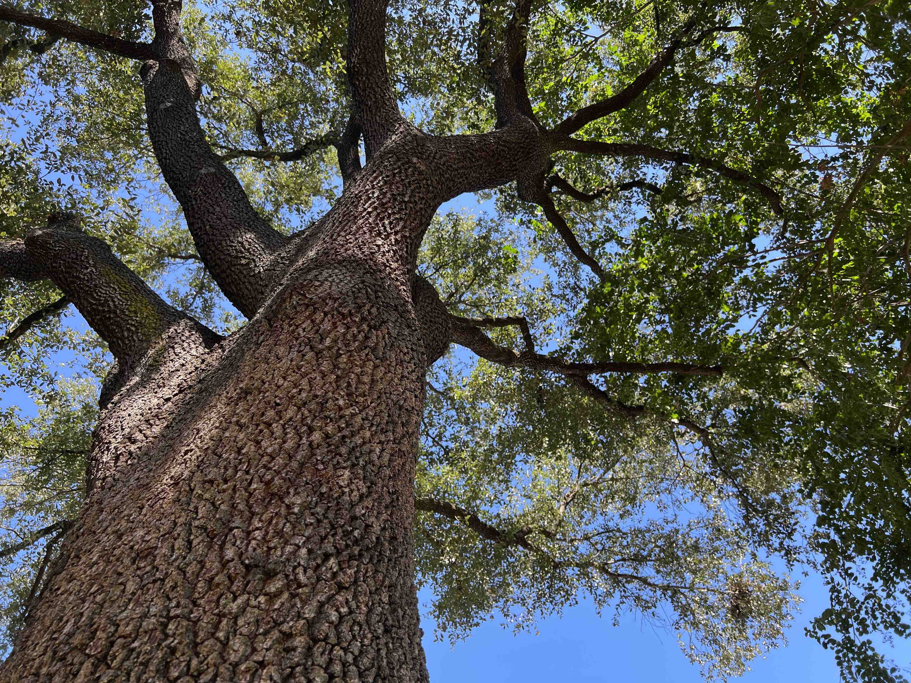

# transfer_learning_VGG16

* Details in the two article series:

  -[Fourier and Bispectral Analysis of Signals](https://www.linkedin.com/posts/justinmackie_fourier-and-bispectral-analysis-of-signals-activity-6980987606071209984-Nmnd?utm_source=share&utm_medium=member_desktop)
  
  -[Transfer Learning with a One-Dimensional Signal](https://medium.com/@mackiej/transfer-learning-with-a-one-dimensional-signal-76a0d543e9aa)

* Please use joblib.load('signals.joblib') to get the signals pandas.DataFrame 
* Images dataset is in the images subfolders.  The two classes are dc (developed cavitation) and nc (no cavitation).
